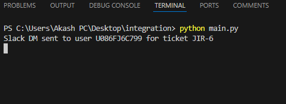
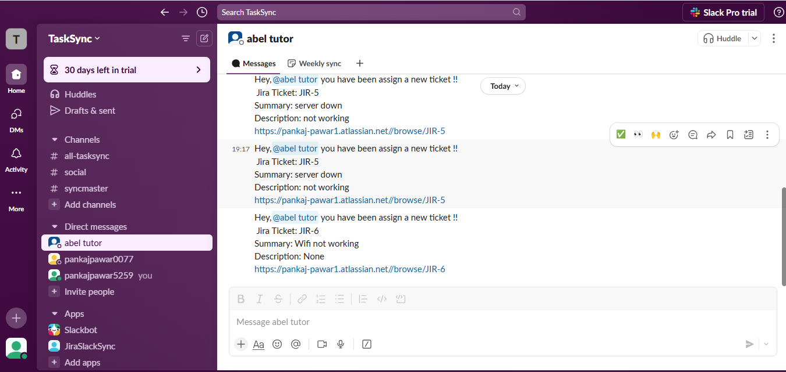
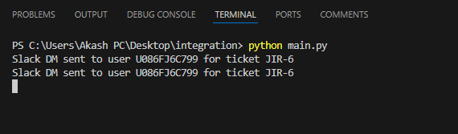
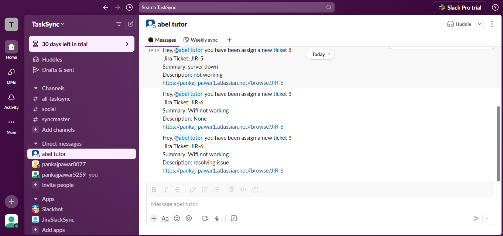
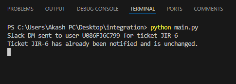

# 📝 Jira-Slack Integration

This project integrates Jira and Slack to notify Slack users about assigned Jira tickets. It fetches assigned tickets from Jira and sends direct messages to the corresponding Slack users.

## 📌 Prerequisites

- Python 3.x

## ⚙️ Installation

1. Install the required Python packages:
- The requirements.txt file is included in the repository.
- Install the dependencies using the following command:
    ```sh
    pip install -r requirements.txt
    ```

## 🔧 Configuration
1️⃣.  Create a .env File
- In the root directory of your project, create a file named .env.
- Add your environment variables in the format: KEY=VALUE.
- Example .env file:
    ```python
    JIRA_URL= https://example.atlassian.net/
    JIRA_USERNAME= dummyuser@example.com
    JIRA_API_TOKEN= YOUR-JIRA-API-TOKEN
    PROJECT_KEY=PROJ1,PROJ2
    SLACK_BOT_TOKEN= YOUR-SLACK-TOKEN
    ```

2️⃣. Update Your Python Code
- Use the load_dotenv() function to load the variables from the .env file into your Python environment.
    ```python
    from dotenv import load_dotenv
    import os

    ## Load environment variables from the .env file
    load_dotenv()

    # Access environment variables
    jira_url = os.getenv("JIRA_URL")
    jira_username = os.getenv("JIRA_USERNAME")
    jira_api_token = os.getenv("JIRA_API_TOKEN")
    project_keys = os.getenv("PROJECT_KEYS")
    slack_bot_token = os.getenv("SLACK_BOT_TOKEN")
    ```
## 📂 Project Structure

- [main.py](http://_vscodecontentref_/3): Entry point of the application. Initializes and starts the integration process.
- [jira_integration.py](http://_vscodecontentref_/4): Contains the [JiraIntegration](http://_vscodecontentref_/5) class to interact with the Jira API.
- [slack_integration.py](http://_vscodecontentref_/6): Contains the [SlackIntegration](http://_vscodecontentref_/7) class to interact with the Slack API.
- [jira_slack_integration.py](http://_vscodecontentref_/8): Contains the [JiraSlackIntegration](http://_vscodecontentref_/9) class to process Jira tickets and notify Slack users.

## ▶️ Run the Application

1. Run the [main.py](http://_vscodecontentref_/2) file to start the integration process:
    ```sh
    python main.py
    ```

2. The script will continuously fetch assigned tickets from Jira and notify the corresponding Slack users every 60 seconds.


## 📸 Below is a screenshot of the application in action:
- Msg in Terminal when ticket is created
 
    
<br>
- Notification in slack DM

    

<br>
<br>

- Msg in Terminal when ticket is updated

    

- Notification in slack DM after update

    

<br>
<br>

- Msg in Terminal when ticket is not updated

    
